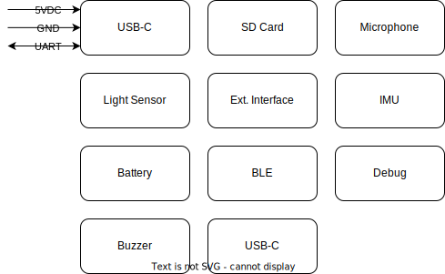

# Design Specification

### Description

The Sensa project is a low-power multi-senor platform designed for application prototyping. The support for several sensors, external communication, battery power and RF enables the exploration of many different applications and ease of development and connectivity. 

### References 

##### Datasheets
| Function | Link | Comment |
| - | - | - |
| MCU | https://infocenter.nordicsemi.com/pdf/nRF5340_PS_v1.3.pdf | (w/ temperature sensor) |
| IMU | https://no.mouser.com/datasheet/2/389/lsm6dsl-1509291.pdf | (w/ temperature sensor) |
| Light Sensor | https://docs.broadcom.com/doc/AV02-4755EN |  |
| Temperature/Humidity Sensor | https://www.sciosense.com/wp-content/uploads/documents/ENS210.pdf |  |
| LEDs | TBD |  |
| USB-C Connector | TBD |  |
| Battery | TBD |  |
| Microphone | https://invensense.tdk.com/wp-content/uploads/2020/05/DS-000357-T3902-v1.0.pdf |  |
| SD Card Connector | TBD |  |
| Communication Connector | TBD |  |
| Power Regulator | TBD |  |
| TVS Diode | TBD |  |

### Features and Limitations
* USB-C power/charging (with 1x UART)
* Power budget 2.5 W (USB limited)
* 5VDC output
* Ground output
* Power, auxillary and reset buttons
* 3 LEDs (power, status, alert)
* BLE or WIFI (TBD)
* IMU (x, y, z, pith, roll)
* Light sensor (visible light)
* Microphone (audible spectrum)
* Temperature and humidity sensor
* SD card
* RTC

### Interfaces

##### USB-C

##### Battery 

##### External Communication/Power

##### GPIO

##### Radio/Antenna

### Functional Description

##### Block Diagram

### Design Specification
* Prioritise IC's with I2C or UART interfaces

##### MCU

##### Power Regulator

##### Battery Management

##### Antenna

##### IMU

##### Light Sensor

##### Microphone

##### Temperature Sensor

##### SD card

### Implementation

### Test and Verification

### Manufacturing

### Future Work
